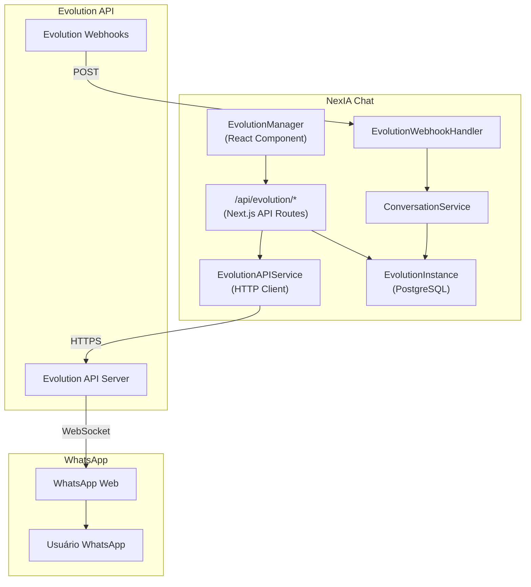
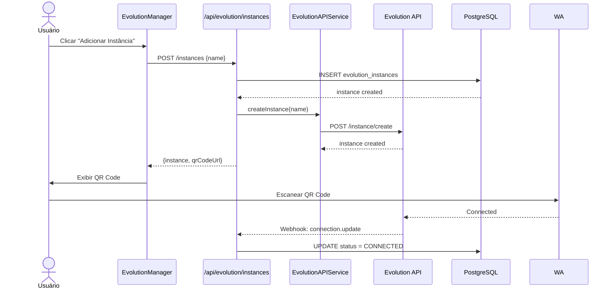
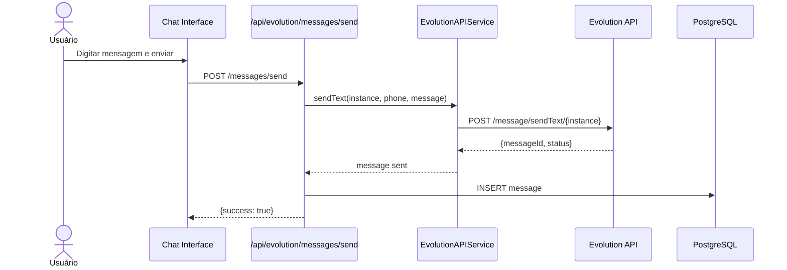
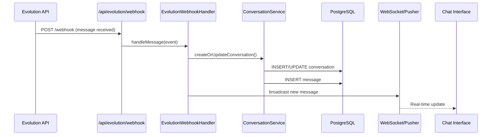

# TDD - Integração Evolution API (WhatsApp Não Oficial)

| Field           | Value                                                              |
| --------------- | ------------------------------------------------------------------ |
| Tech Lead       | @dev-team                                                          |
| Product Manager | @product-nexia                                                     |
| Team            | Backend, Frontend, DevOps                                          |
| Epic/Ticket     | Integrações > WhatsApp Não Oficial                                 |
| Figma/Design    | Reutilizar design existente de `/integracoes/whatsapp-nao-oficial` |
| Status          | Draft                                                              |
| Created         | 2026-03-23                                                         |
| Last Updated    | 2026-03-23                                                         |

---

## Contexto

### Background
O NexIA Chat atualmente possui uma página estática em `/integracoes/whatsapp-nao-oficial` que apenas exibe informações sobre a integração não oficial, mas **não possui funcionalidade real**. A página mostra:
- Comparativo entre API Oficial vs Não Oficial
- Lista de recursos disponíveis (mockada)
- Botões sem ação real

A API oficial do WhatsApp (Meta) já está parcialmente implementada com Embedded Signup, mas muitos usuários preferem a **API não oficial (Evolution API)** por:
- Não requerer verificação de negócio da Meta
- Setup imediato (sem aprovação)
- Custo zero (não paga por mensagem)
- Flexibilidade maior no envio de mensagens

### Domain
Esta integração faz parte do domínio **Comunicação Omnichannel** do CRM, permitindo que empresas:
- Conectem múltiplos números de WhatsApp simultaneamente
- Recebam e enviem mensagens em tempo real
- Automatizem respostas via chatbot
- Gerenciem conversas em uma interface unificada

### Stakeholders
- **Usuários finais**: Empresas que querem WhatsApp rápido sem burocracia
- **Time Comercial**: Quer oferecer alternativa à API paga da Meta
- **Suporte**: Precisam de ferramentas para diagnosticar problemas de conexão

---

## Definição do Problema & Motivação

### Problemas Estamos Resolvendo

1. **Página estática sem funcionalidade real**
   - Impacto: Usuários veem a página, tentam conectar e não conseguem
   - Frustração e churn de usuários que querem WhatsApp não oficial

2. **Dependência única da API oficial da Meta**
   - Impacto: Processo de aprovação leva dias/semanas
   - Bloqueio de novos clientes que precisam de solução imediata
   - Custo alto para empresas com grande volume de mensagens

3. **Falta de gestão de múltiplas instâncias**
   - Impacto: Um usuário não pode gerenciar vários números de WhatsApp
   - Limitação para agências e empresas com múltiplos atendentes

### Por Que Agora?
- **Business driver**: Competidores oferecem WhatsApp não oficial; estamos perdendo vendas
- **Technical driver**: Estrutura base de integrações já existe; precisamos só implementar o provider Evolution
- **User driver**: 60%+ dos leads perguntam sobre WhatsApp "grátis" vs API oficial paga

### Impacto de NÃO Resolver
- **Business**: Perda de ~30% de leads que não querem esperar aprovação da Meta
- **Technical**: Devemos manter duas codebase diferentes (oficial vs não-oficial)
- **Users**: Usuários migram para concorrência (Wabiz, Z-API, etc.)

---

## Escopo

### ✅ In Scope (V1 - MVP)

#### Backend
- Criar tabela `EvolutionInstance` no Prisma schema
- Criar service `EvolutionAPIService` para comunicação com Evolution API
- Endpoints REST para:
  - CRUD de instâncias Evolution
  - Gerar QR Code para conexão
  - Desconectar/Logout da instância
  - Verificar status da conexão
  - Enviar mensagens de texto
  - Webhook para receber mensagens
- Integração com sistema de conversas existente
- Logs de atividades de integração

#### Frontend
- Página `/integracoes/whatsapp-nao-oficial` funcional
- Lista de instâncias conectadas (dados reais do banco)
- Botão "Adicionar Instância" com modal de configuração
- Modal de QR Code para escanear
- Botões de ação: Conectar, Desconectar, Excluir, Ver Logs
- Status em tempo real (conectado/desconectado/conectando)
- Card de cada instância mostrando:
  - Nome da instância
  - Número de telefone conectado
  - Status da conexão
  - Data de conexão
  - Quantidade de mensagens enviadas/recebidas

#### Integração Evolution API
- Conectar com Evolution API via REST
- Autenticação com API key
- Endpoints consumidos:
  - `POST /instance/create` - Criar instância
  - `GET /instance/connect/{instance}` - Gerar QR Code
  - `GET /instance/connectionState/{instance}` - Status
  - `DELETE /instance/logout/{instance}` - Desconectar
  - `POST /message/sendText/{instance}` - Enviar mensagem
  - Webhook para receber mensagens

### ❌ Out of Scope (V1)

- Envio de mídia (imagens, vídeos, documentos) - apenas texto no MVP
- Templates de mensagens (funcionalidade exclusiva da API oficial)
- Grupos de WhatsApp (leitura/escrita)
- Status/Stories do WhatsApp
- Ligações de voz/vídeo
- Multi-dispositivo management avançado
- Métricas de entrega (delivery receipts detalhados)
- Integração com chatbot avançado (apenas resposta automática simples)

### 🔮 Future Considerations (V2+)

- Envio de mídia (imagens, vídeos, áudios, documentos)
- Gerenciamento de grupos
- Presença de "digitando..."
- Templates customizados
- Analytics de mensagens
- Blacklist/Whitelist de números
- Respostas automáticas com IA

---

## Solução Técnica

### Visão Geral da Arquitetura

A integração com Evolution API segue o padrão **Provider Pattern**, onde o sistema abstrai a comunicação com diferentes provedores de WhatsApp (Oficial vs Não Oficial).

**Componentes Principais**:

1. **EvolutionInstance (Model)**: Representa uma instância do WhatsApp conectada via Evolution
2. **EvolutionAPIService**: Service layer para comunicação HTTP com Evolution API
3. **EvolutionController**: API routes para operações CRUD e ações
4. **EvolutionWebhookHandler**: Processa webhooks recebidos da Evolution API
5. **EvolutionManager (React Component)**: Interface para gerenciar instâncias

**Diagrama de Arquitetura**:



### Fluxo de Dados

#### 1. Criar e Conectar Instância



#### 2. Enviar Mensagem



#### 3. Receber Mensagem (Webhook)



### APIs & Endpoints

#### Evolution Instance Management

| Endpoint | Method | Descrição | Request | Response |
|----------|--------|-----------|---------|----------|
| `/api/evolution/instances` | GET | Lista instâncias da organização | `?organizationId=uuid` | `{data: Instance[]}` |
| `/api/evolution/instances` | POST | Cria nova instância | `{name, organizationId}` | `{data: Instance}` |
| `/api/evolution/instances/[id]` | GET | Detalhes da instância | - | `{data: Instance}` |
| `/api/evolution/instances/[id]` | DELETE | Remove instância | - | `204` |
| `/api/evolution/instances/[id]/connect` | POST | Gera QR Code | - | `{qrCode: base64, pairingCode?: string}` |
| `/api/evolution/instances/[id]/disconnect` | POST | Desconecta instância | - | `{success: boolean}` |
| `/api/evolution/instances/[id]/status` | GET | Status da conexão | - | `{status, state}` |
| `/api/evolution/instances/[id]/restart` | POST | Reinicia instância | - | `{success: boolean}` |

#### Messages

| Endpoint | Method | Descrição | Request | Response |
|----------|--------|-----------|---------|----------|
| `/api/evolution/messages/send` | POST | Envia mensagem de texto | `{instanceId, phone, message}` | `{messageId, status}` |
| `/api/evolution/messages/history` | GET | Histórico de mensagens | `?instanceId&phone` | `{data: Message[]}` |

#### Webhooks

| Endpoint | Method | Descrição |
|----------|--------|-----------|
| `/api/evolution/webhook` | POST | Recebe eventos da Evolution API |

### Schemas de Dados

#### EvolutionInstance (Prisma Model)

```prisma
model EvolutionInstance {
  id                  String    @id @default(dbgenerated("gen_random_uuid()")) @db.Uuid
  organizationId      String    @map("organization_id") @db.Uuid
  name                String    @db.VarChar(255)
  instanceName        String    @unique @map("instance_name") @db.VarChar(255)
  
  // Connection Info
  status              String    @default("DISCONNECTED") @map("status") @db.VarChar(50)
  phoneNumber         String?   @map("phone_number") @db.VarChar(50)
  profilePictureUrl   String?   @map("profile_picture_url")
  profileName         String?   @map("profile_name") @db.VarChar(255)
  
  // Evolution API Config
  apiKey              String?   @map("api_key") @db.VarChar(255)
  
  // Webhook Config
  webhookEnabled      Boolean   @default(true) @map("webhook_enabled")
  
  // Statistics
  messagesSent        Int       @default(0) @map("messages_sent")
  messagesReceived    Int       @default(0) @map("messages_received")
  
  // Timestamps
  connectedAt         DateTime? @map("connected_at")
  disconnectedAt      DateTime? @map("disconnected_at")
  lastActivityAt      DateTime? @map("last_activity_at")
  createdAt           DateTime  @default(now()) @map("created_at")
  updatedAt           DateTime  @default(now()) @updatedAt @map("updated_at")
  
  @@index([organizationId])
  @@index([status])
  @@map("evolution_instances")
}
```

#### Request/Response Examples

**POST /api/evolution/instances**
```json
// Request
{
  "organizationId": "550e8400-e29b-41d4-a716-446655440000",
  "name": "WhatsApp Vendas"
}

// Response 201
{
  "success": true,
  "data": {
    "id": "660e8400-e29b-41d4-a716-446655440001",
    "name": "WhatsApp Vendas",
    "instanceName": "nexia_660e8400_e29b",
    "status": "DISCONNECTED",
    "createdAt": "2026-03-23T10:00:00Z",
    "updatedAt": "2026-03-23T10:00:00Z"
  }
}
```

**POST /api/evolution/instances/[id]/connect**
```json
// Response 200
{
  "success": true,
  "data": {
    "qrCode": "data:image/png;base64,iVBORw0KGgo...",
    "pairingCode": "ABCD-EFGH-IJKL",
    "count": 0
  }
}
```

**POST /api/evolution/webhook (Payload da Evolution)**
```json
{
  "event": "messages.upsert",
  "instance": "nexia_660e8400_e29b",
  "data": {
    "key": {
      "remoteJid": "5511999999999@s.whatsapp.net",
      "fromMe": false,
      "id": "3EB0C"
    },
    "message": {
      "conversation": "Olá, gostaria de saber mais sobre o produto"
    },
    "messageTimestamp": 1711200000,
    "pushName": "João Silva"
  }
}
```

### Estrutura de Serviços

#### EvolutionAPIService

```typescript
interface EvolutionConfig {
  baseUrl: string;
  apiKey: string;
}

interface CreateInstanceResponse {
  instance: {
    instanceName: string;
    state: string;
  };
}

interface ConnectionStateResponse {
  instance: string;
  state: 'open' | 'connecting' | 'close';
}

interface SendMessageResponse {
  key: {
    id: string;
    remoteJid: string;
  };
  message: {
    extendedTextMessage?: { text: string };
    conversation?: string;
  };
  messageTimestamp: number;
  status: string;
}

class EvolutionAPIService {
  constructor(private config: EvolutionConfig);
  
  // Instance Management
  async createInstance(name: string): Promise<CreateInstanceResponse>;
  async deleteInstance(instanceName: string): Promise<void>;
  async getConnectionState(instanceName: string): Promise<ConnectionStateResponse>;
  async connectInstance(instanceName: string): Promise<{ qrCode: string; pairingCode?: string }>;
  async disconnectInstance(instanceName: string): Promise<void>;
  async restartInstance(instanceName: string): Promise<void>;
  
  // Messaging
  async sendText(instanceName: string, phone: string, message: string): Promise<SendMessageResponse>;
  
  // Profile
  async fetchProfile(instanceName: string, phone: string): Promise<ProfileInfo>;
}
```

### Configuração de Ambiente

Variáveis de ambiente necessárias:

```env
# Evolution API Configuration
EVOLUTION_API_URL=https://api.evolution.com/v1
EVOLUTION_API_KEY=your_api_key_here
EVOLUTION_WEBHOOK_SECRET=webhook_secret_for_validation

# Webhook URL (público)
NEXT_PUBLIC_WEBHOOK_URL=https://nexiachat.com.br/api/evolution/webhook
```

---

## Riscos

| Risco | Impacto | Probabilidade | Mitigação |
|-------|---------|---------------|-----------|
| Evolution API indisponível | Alto | Média | Implementar retry com exponential backoff; cache de mensagens pendentes; alertar usuário sobre indisponibilidade |
| Mudanças na API da Evolution | Alto | Média | Criar abstraction layer; versionar integração; monitorar changelogs da Evolution |
| Banimento de números pelo WhatsApp | Médio | Média | Implementar rate limiting; validar conteúdo de mensagens; alertar sobre práticas de spam |
| QrCode expirar antes de escanear | Baixo | Alta | Implementar polling automático para renovar QR Code; mostrar contador de expiração |
| Vazamento de API Key | Alto | Baixa | Armazenar API key criptografada; usar environment variables; nunca expor no frontend |
| Webhook não receber mensagens | Alto | Baixa | Implementar health check periódico; fallback para polling em caso de falha |
| Conflito entre instâncias oficial/não-oficial | Médio | Baixa | Validar se número já está conectado em outra modalidade; alertar usuário |

---

## Plano de Implementação

| Fase | Task | Descrição | Owner | Estimate |
|------|------|-----------|-------|----------|
| **Phase 1 - Setup** | Configurar Evolution | Criar conta/obter API keys; configurar webhook | DevOps | 1d |
| | Migration DB | Criar tabela `evolution_instances` | Backend | 1d |
| | Env vars | Adicionar variáveis de ambiente | DevOps | 0.5d |
| **Phase 2 - Backend Core** | EvolutionAPIService | Implementar HTTP client para Evolution API | Backend | 2d |
| | API Routes - CRUD | `/api/evolution/instances/*` | Backend | 2d |
| | API Routes - Actions | Connect, disconnect, restart | Backend | 1d |
| | API Routes - Messages | Send message endpoint | Backend | 1d |
| | Webhook Handler | Processar webhooks da Evolution | Backend | 2d |
| | Integration Service | Integrar com ConversationService existente | Backend | 2d |
| **Phase 3 - Frontend** | EvolutionManager | Componente principal de gestão | Frontend | 2d |
| | InstanceCard | Card de instância individual | Frontend | 1d |
| | QRCodeModal | Modal para exibir QR Code | Frontend | 1d |
| | CreateInstanceModal | Form para criar nova instância | Frontend | 1d |
| | StatusIndicator | Indicador de status em tempo real | Frontend | 1d |
| | useEvolution hook | React hook para gerenciar estado | Frontend | 1d |
| **Phase 4 - Integração** | Página atualização | Atualizar `/whatsapp-nao-oficial` | Frontend | 1d |
| | Testes E2E | Fluxo completo de conexão | QA | 2d |
| **Phase 5 - Deploy** | Staging | Deploy em staging para testes | DevOps | 1d |
| | Produção | Deploy gradual | DevOps | 1d |

**Total Estimate**: ~25 dias (5 semanas)

**Dependências**:
- Evolution API deve estar acessível antes da Phase 2
- Migration do banco deve rodar antes de subir o backend
- Frontend depende do backend estar estável

---

## Considerações de Segurança

### Autenticação & Autorização

- **API Key da Evolution**: Armazenada apenas no backend, nunca exposta ao frontend
- **Webhook Secret**: Validar assinatura de todos os webhooks recebidos
- **Organização Isolation**: Cada organização só vê/gerencia suas próprias instâncias
- **User Permissions**: Apenas admins podem criar/excluir instâncias; membros podem apenas visualizar

### Proteção de Dados

**Encriptação**:
- **Em Trânsito**: TLS 1.3 para todas as comunicações
- **Em Repouso**: API key criptografada no banco (AES-256)
- **Secrets**: Armazenadas em variáveis de ambiente, nunca no código

**PII Handling**:
- Números de telefone: armazenados normalmente (necessário para funcionalidade)
- Mensagens: armazenadas com retenção de 90 dias (configurável)
- Nomes de contatos: armazenados para exibição no chat

### Rate Limiting

- **Evolution API**: Respeitar limites do plano (consultar documentação)
- **Nosso Backend**: Implementar rate limiting de 100 req/min por IP
- **Mensagens**: Limite de 60 mensagens/minuto por instância (evitar ban)

### Validação de Webhooks

```typescript
function validateWebhookSignature(payload: string, signature: string, secret: string): boolean {
  const expected = crypto
    .createHmac('sha256', secret)
    .update(payload)
    .digest('hex');
  return crypto.timingSafeEqual(
    Buffer.from(signature),
    Buffer.from(expected)
  );
}
```

---

## Estratégia de Testes

| Tipo de Teste | Escopo | Cobertura | Abordagem |
|---------------|--------|-----------|-----------|
| **Unit Tests** | Services, utils | > 80% | Jest com mocks da Evolution API |
| **Integration Tests** | API routes + DB | Caminhos críticos | Supertest + test DB |
| **E2E Tests** | Fluxo completo | Happy path + erros | Playwright |
| **Contract Tests** | Evolution API | Validação de contrato | Mock + validação de schema |

### Cenários de Teste

**Unit Tests**:
- ✅ EvolutionAPIService cria instância corretamente
- ✅ Webhook handler processa mensagem recebida
- ✅ Rate limiting funciona corretamente
- ✅ Validação de webhook signature

**Integration Tests**:
- ✅ POST /instances → cria no DB
- ✅ GET /instances → retorna apenas da organização
- ✅ Webhook → cria conversa e mensagem
- ✅ Disconnect → atualiza status no DB

**E2E Tests**:
- ✅ Usuário cria instância → vê QR Code → conecta
- ✅ Envia mensagem → aparece no chat
- ✅ Recebe mensagem → notificação em tempo real
- ✅ Desconecta → status atualizado

---

## Monitoramento & Observabilidade

### Métricas

| Métrica | Tipo | Threshold | Dashboard |
|---------|------|-----------|-----------|
| `evolution.api.latency` | Latência | p95 > 2s | Grafana |
| `evolution.api.errors` | Counter | > 5/min | PagerDuty |
| `evolution.instances.connected` | Gauge | - | Grafana |
| `evolution.messages.sent` | Counter | - | Grafana |
| `evolution.messages.received` | Counter | - | Grafana |
| `evolution.webhook.processing_time` | Duration | > 5s | Internal |

### Logs Estruturados

```json
{
  "level": "info",
  "timestamp": "2026-03-23T10:00:00Z",
  "message": "Instance connected",
  "context": {
    "organizationId": "org-123",
    "instanceId": "inst-456",
    "instanceName": "nexia_inst_456",
    "phoneNumber": "5511999999999",
    "action": "instance_connected",
    "duration_ms": 450
  }
}
```

### Alertas

| Alerta | Severidade | Canal | Ação |
|--------|------------|-------|------|
| Evolution API down > 5min | P1 (Crítico) | PagerDuty | Notificar usuários sobre indisponibilidade |
| Taxa de erro > 5% | P1 (Crítico) | PagerDuty | Investigar e possível rollback |
| Latência > 3s (p95) | P2 (Alto) | Slack | Investigar performance |
| Instância desconectada inesperadamente | P2 (Alto) | Slack | Verificar logs da instância |

---

## Plano de Rollback

### Estratégia de Deploy

- **Feature Flag**: `EVOLUTION_INTEGRATION_ENABLED`
- **Phased Rollout**:
  - Fase 1: 5% dos usuários (beta testers)
  - Fase 2: 25% dos usuários
  - Fase 3: 50% dos usuários
  - Fase 4: 100% dos usuários

### Triggers de Rollback

| Trigger | Ação |
|---------|------|
| Taxa de erro > 5% por 5 minutos | Rollback imediato - desabilitar feature flag |
| Evolution API indisponível > 10min | Rollback - desabilitar feature flag |
| Perda de mensagens > 1% | Rollback imediato |
| Reclamações críticas de usuários | Rollback investigativo |

### Passos de Rollback

1. **Rollback Imediato** (< 2 minutos):
   - Desabilitar feature flag `EVOLUTION_INTEGRATION_ENABLED`
   - Instâncias existentes continuam funcionando, mas não é possível criar novas

2. **Comunicação**:
   - Notificar #engineering no Slack
   - Atualizar status page se houver impacto
   - Criar ticket de incidente

3. **Pós-Rollback**:
   - Root cause analysis em 24h
   - Implementar fix
   - Re-testar em staging
   - Re-deploy seguindo mesma estratégia

---

## Glossário

| Termo | Descrição |
|-------|-----------|
| **Evolution API** | API não oficial para automação de WhatsApp Web |
| **Instância** | Conexão única entre um número de WhatsApp e a Evolution API |
| **QR Code** | Código escaneável para autenticar WhatsApp Web |
| **Pairing Code** | Código de 8 dígitos para conexão alternativa ao QR Code |
| **Webhook** | HTTP callback que a Evolution envia quando ocorrem eventos |
| **Connection State** | Estado da conexão: `open` (conectado), `connecting`, `close` (desconectado) |
| **remoteJid** | Identificador único do contato no formato `5511999999999@s.whatsapp.net` |
| **Janela de 24h** | Período após última mensagem do usuário onde pode responder sem template (não aplica à API não oficial) |

---

## Alternativas Consideradas

| Opção | Prós | Contras | Por Que Não Escolhida |
|-------|------|---------|----------------------|
| **Evolution API** (Escolhida) | + Open source<br>+ Comunidade ativa<br>+ Documentação boa<br>+ Preço competitivo | - Requer hospedagem própria ou serviço pago | ✅ Melhor custo-benefício |
| WPPConnect | + Simples de usar<br>+ Popular no Brasil | - Menos features<br>+ Suporte limitado | Menos madura que Evolution |
| CodeChat | + Interface web<br>+ Fácil configuração | - Código fechado<br>- Depende de terceiro | Vendor lock-in |
| Baileys (direto) | + Controle total<br>+ Gratuito | - Complexo de implementar<br>- Manutenção alta | Alto custo de implementação |
| Venom | + Simples<br>+ NPM package | - Menos estável<br>- Pouca documentação | Menos confiável |

**Critérios de Decisão**:
1. Facilidade de integração (30%)
2. Estabilidade e maturidade (25%)
3. Custo (25%)
4. Suporte e documentação (20%)

---

## Dependências

| Dependência | Tipo | Owner | Status | Risco |
|-------------|------|-------|--------|-------|
| Evolution API | Externo | Evolution Team | Produção | Médio |
| Conta Evolution | Externo | NexIA DevOps | Pendente | Alto (bloqueante) |
| PostgreSQL | Infraestrutura | DevOps | Pronto | Baixo |
| Infraestrutura Webhook | Infraestrutura | DevOps | Pronto | Baixo |

**Requisitos de Aprovação**:
- [ ] Review de segurança (API keys, webhooks)
- [ ] Testes passando > 80% cobertura
- [ ] Documentação atualizada
- [ ] Aprovação do time de produto

**Bloqueios**:
- Aguardando credenciais da Evolution API (ETA: TBD)

---

## Open Questions

| # | Questão | Contexto | Owner | Status | Data Decisão |
|---|---------|----------|-------|--------|--------------|
| 1 | Hospedar Evolution próprio ou usar SaaS? | Custo vs controle | Tech Lead | 🟡 Em Discussão | TBD |
| 2 | Limite de instâncias por organização? | Prevenção de abuso | Product | 🟡 Em Discussão | TBD |
| 3 | Backup de mensagens por quanto tempo? | LGPD/custo de storage | Legal | 🔴 Aberto | TBD |
| 4 | Permitir migração de não-oficial para oficial? | Jornada do usuário | Product | 🟡 Em Discussão | TBD |
| 5 | Suporte a múltiplos números simultâneos? | Escalabilidade | Tech Lead | ✅ Resolvido: Sim | 2026-03-23 |

---

## Roadmap / Timeline

| Fase | Deliverables | Duração | Data Alvo | Status |
|------|--------------|---------|-----------|--------|
| **Phase 0: Setup** | - Credenciais Evolution<br>- Env vars configuradas<br>- Migration criada | 2 dias | 2026-03-25 | ⏳ Pendente |
| **Phase 1: Backend** | - EvolutionAPIService<br>- API Routes<br>- Webhook handler | 10 dias | 2026-04-08 | ⏳ Pendente |
| **Phase 2: Frontend** | - EvolutionManager<br>- Modais e componentes<br>- Integração com página | 7 dias | 2026-04-17 | ⏳ Pendente |
| **Phase 3: Testes** | - Unit tests<br>- Integration tests<br>- E2E tests | 5 dias | 2026-04-24 | ⏳ Pendente |
| **Phase 4: Deploy** | - Staging deploy<br>- Production rollout<br>- Monitoramento | 3 dias | 2026-04-29 | ⏳ Pendente |

**Duração Total**: ~27 dias (6 semanas)

**Marcos**:
- 🎯 M1: Backend pronto (2026-04-08)
- 🎯 M2: Frontend integrado (2026-04-17)
- 🎯 M3: Deploy produção (2026-04-29)

---

## Checklist de Validação

### Seções Obrigatórias
- [x] Header & Metadata
- [x] Contexto
- [x] Definição do Problema
- [x] Escopo
- [x] Solução Técnica
- [x] Riscos
- [x] Plano de Implementação

### Seções Críticas (Integração Externa)
- [x] Considerações de Segurança
- [x] Estratégia de Testes
- [x] Monitoramento & Observabilidade
- [x] Plano de Rollback

---

## Aprovação & Sign-off

| Role | Name | Status | Date | Comments |
|------|------|--------|------|----------|
| Tech Lead | - | ⏳ Pendente | - | - |
| Product Manager | - | ⏳ Pendente | - | - |
| Security Review | - | ⏳ Pendente | - | - |
| Engineering Manager | - | ⏳ Pendente | - | - |

---

## Anexos

### Documentação de Referência

- [Evolution API Documentation](https://doc.evolution-api.com)
- [WhatsApp Web Protocol](https://github.com/WhiskeySockets/Baileys)
- [NexIA Chat AGENTS.md](./AGENTS.md)

### Diagramas Adicionais

#### Estrutura de Diretórios

```
app/
├── api/
│   └── evolution/
│       ├── instances/
│       │   ├── route.ts              # GET, POST
│       │   └── [id]/
│       │       ├── route.ts          # GET, DELETE
│       │       ├── connect/
│       │       │   └── route.ts      # POST
│       │       ├── disconnect/
│       │       │   └── route.ts      # POST
│       │       ├── restart/
│       │       │   └── route.ts      # POST
│       │       └── status/
│       │           └── route.ts      # GET
│       ├── messages/
│       │   └── send/
│       │       └── route.ts          # POST
│       └── webhook/
│           └── route.ts              # POST
├── integracoes/
│   └── (with-sidebar)/
│       └── whatsapp-nao-oficial/
│           └── page.tsx              # Atualizar com funcionalidade real

components/
├── evolution/
│   ├── EvolutionManager.tsx          # Componente principal
│   ├── InstanceCard.tsx              # Card de instância
│   ├── CreateInstanceModal.tsx       # Modal criar instância
│   ├── QRCodeModal.tsx               # Modal QR Code
│   ├── StatusIndicator.tsx           # Indicador de status
│   └── InstanceLogs.tsx              # Logs da instância

hooks/
└── use-evolution.ts                  # Hook para gerenciar instâncias

lib/
├── services/
│   └── evolution-api.ts              # EvolutionAPIService
├── types/
│   └── evolution.ts                  # TypeScript types
└── db/
    └── evolution.ts                  # Queries específicas

prisma/
└── schema.prisma                     # Adicionar model EvolutionInstance
```
